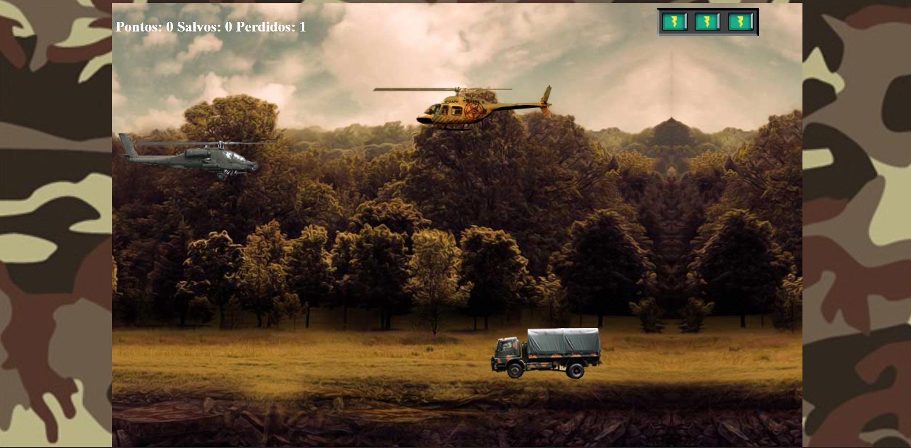

# Apache Rescue
Desafio de código da Digital Innovation One

Utilizando conhecimentos básicos de html, css e js, o objetivo era a utilização do JQuery-collision. 
Fiz algumas alterações para melhor desenvolvimento do jogo 
Projeto simples, porém, muito útil para relembrar alguns conceitos.

